 Card View Addon
===============

> **IMPORTANT!**  The view name, and thus the ini configuration file names, have changed yet again. Be sure to remove any previous versions of this view you have installed and to remove all previous ini files before using this latest copy.  This was originally named the **ProfileView** and then the **LinkedView** as that better described the navigation model.  Note this will be the last and final name change.

> Please check the [known issues](KNOWN_ISSUES.md) before reporting a bug or problem with the addons here.

*A [third-party add-on](https://www.gramps-project.org/wiki/index.php/5.1_Addons#Addon_List) for the [Gramps](https://gramps-project.org) family of genealogy software* 

This is an *introductory* **ReadMe.md** document.  The [in-depth documentation](https://www.gramps-project.org/wiki/index.php/Addon:CardView) is perpetually in development on the [Gramps information portal](https://gramps-project.org/wiki/index.php/Portal:Using_Gramps)

The **CardView** Addon is now actually a group of view, gramplet and other plugins that work together to provide an alternate interface that enables the user to navigate through the data in a Gramps genealogy database.  It uses something similar to the Card motif popularized in modern web design to provide a visual overview of the data.  In addition to the core card views it includes a simple list view for tags and a last changed gramplet.

This add-on is far enough along in development that it can be considered early beta. Note all development and most testing to date has been done on Fedora.

YOU SHOULD STILL backup your tree regularly. Or even better, use a different copy of your tree when exploring any of the add/edit/delete or drag and drop functionality.

Installation
---------------

As a Gramps add-on, the **CardView** can be installed by creating a gramps51/plugins/CardView subdirectory under your [User Directory](https://gramps-project.org/wiki/index.php/Gramps_5.1_Wiki_Manual_-_User_Directory) and then copying or cloning the full contents of this repository into place. Note in Linux the path would be ~/.gramps/gramps51/plugins/CardView

Feature Overview
---------------

### Visual layout

Each page is broken into two parts. The header section at the top contains the card for the active object and the group section on the bottom contains groups of cards for different objects associated with the active object.

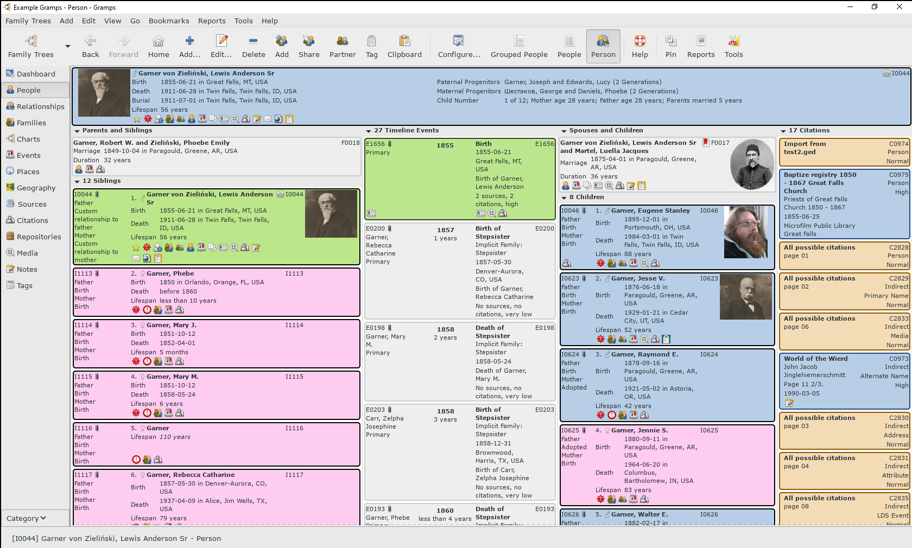

Many pages will contain multiple cards in the header. For the citation page the source card is shown above the citation card. On the family page the primary parents of each partner are shown above the couple to help add context and to enable navigation. Child and event reference pages will contain both objects involved in the reference and the reference information itself in the header. Note if the user is not sure which is the active object there is a configuration option that can be enabled to "highlight" it.

Each view is built around a primary object, and several pages may be available that are associated with that object.  These will be displayed in the same view pane under the same category. When navigating to a different primary object the view will then switch to the view pane in that category to render the page.

Tags are not primary objects in Gramps, but both a more traditional though bare bones list view has been added for them in addition to a card view. As a result a Tags category will be added to the navigation bar to support the new views.

Note that the groups rendered in the group section of the view are fully user configurable. A reasonable set of defaults has been selected, but you can add groups for associations, ordinances, names or anything else if you choose.

Each card is broken into multiple sections, not all of which may be active. The image if one is available may optionally be on the right or left side, and some cards may expose an age or date field on the left side as well. The primary fact section will have a title for the card and then a set of facts, such as events and their dates and locations for a person. When the card is in the header more space is available so an additional secondary fact section is available. Underneath the fact sections is the icon indicator section. The left of the frame then acts as a metadata section. The top portion optionally shows the Gramps Id, bookmark, privacy and home person indicators. Beneath that may be a list of attributes or other information.

Some cards have an associated reference section that may be visible as well. The location is configurable, it can be rendered on the right or left or top or bottom. In groups usually it is on the left and in headers it is usually on the bottom.  Generally the reference section contains three parts. The first is the metadata indicator section that will show a link icon to indicate it is a reference, privacy indicator if applicable, and the Gramps Id of the object the reference points to. Additional attributes or information about the reference are displayed beneath. The bottom then contains an icon indicator section in case the reference has citations or notes associated with it.

### Browser like navigation style

You can navigate to a new object page by left clicking on a given card or elements within the card such as a title, text link or tag icon. You can also navigate to views of secondary objects like a child, event, or person reference or a name or LDS ordinance. Note these secondary objects as well as tags will be in the global navigation history so you can move backward and forward again, but only primary objects will appear in the Go menu.

This navigation style is enabled by a navigation history class derived from Nick Hall's [Combined View add-on](https://www.gramps-project.org/wiki/index.php/Addon:CombinedView) but extended to try to handle all primary and secondary objects. It is not able to handle navigating to secondary objects embedded within other secondary objects though, so some use cases are not supported. It attempts to update and stay in sync with the linear object navigation histories used by the various list views.

### Drag and drop support

Drag and drop support has been enabled for both the cards as well as some of the object groups.

You can drag and drop text from your browser onto a card to create a new note, drag and drop a source from the clipboard onto something to add a citation, drag and drop children in a family group to reorder them, drop a person on a family to add them as a child, or drop a URL on a card to add it if the underlying object supports it. Various other combinations are also supported.

Note drag and drop from a browser window has only been tested with Firefox, so your mileage may vary with other browsers as well as on other platforms.

### Action context menu

The action context menu for any card can be activated with a right click.

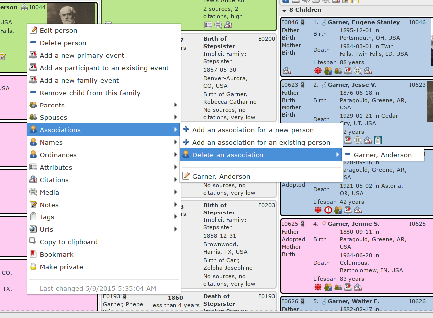

A large range of actions have been made available. Some are largely common to all objects, like adding a note or toggling privacy status.  Others may be sensitive to the context of the object in relation to others. For example a child card in a family will expose an option to remove the child from the family.

### Bookmark context menu

The bookmark context menu is activated with a ctrl right click on any card.

This menu does not vary by card like the others. All utilized bookmark categories and bookmarks are exposed under it for quick selection and navigation to the bookmarked object.

### Configuration context menu

The configuration context menu for any card is activated with a middle click.

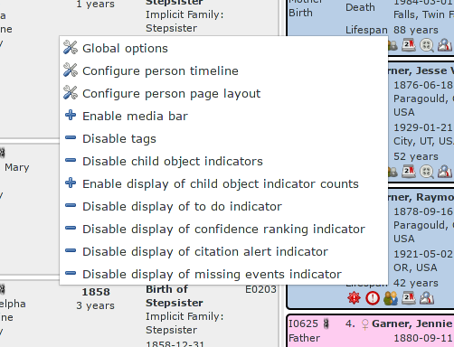

This menu will have options to take you to the global configuration options panel, the particular configuration panel for the selected card, the configuration panel for the current page layout, as well as provide some useful toggles to quickly enable or disable some of the display features.
 
### Pinned views

The copy document icon labelled Pin in the toolbar that sits next to the Help life buoy enables you to "pin" the current view by spawning a copy of it in a separate external window.

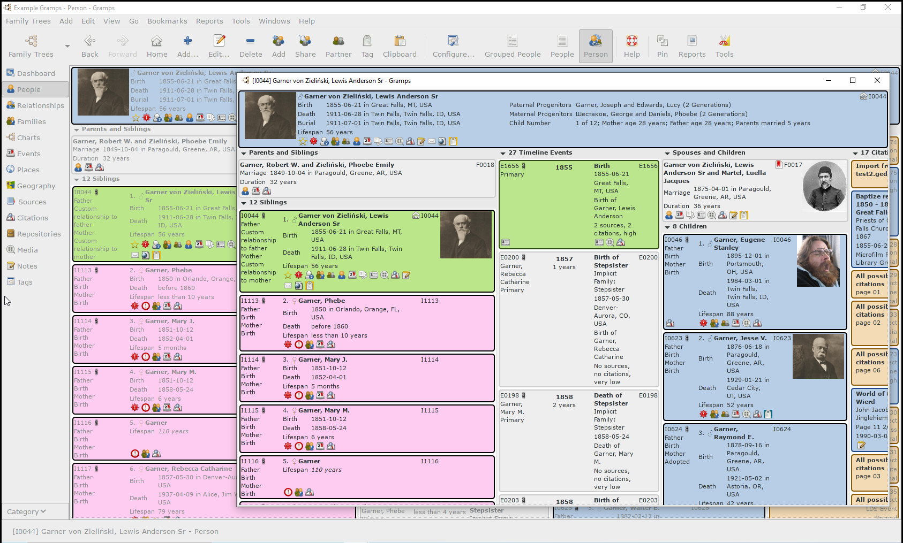

This is primarily intended for dual monitor setups. Navigation events triggered in the pinned view will occur in the main view instead of changing the pinned view. Context menu actions and drag and drop actions can be performed with objects in the pinned view. You can drag an object from the pinned view and drop it elsewhere on the main view or visa versa. When editing and modifying objects the pinned view will refresh to reflect the changes without changing context.

Multiple pinned views can be spawned, the number is user configurable, but performance will be impacted to some extent on slower machines.

### Templated configuration options

The view is highly customizable, and user preferences are managed through a multi-layered template scheme. A template manager is provided for managing, editing and switching between them.

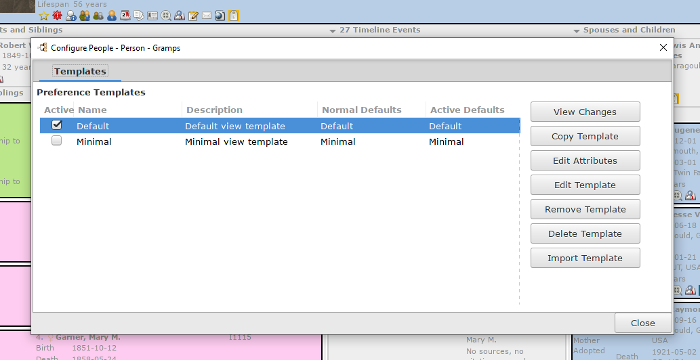

There is also a template plugin interface and a simple minimal view template plugin is provided. This template has most configuration options disabled to provide a much more condensed presentation of the data.

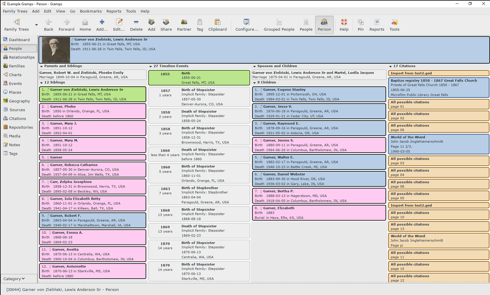

Options are managed at three levels. The first level consists of the default options that are either the built in ones or provided by a template plugin. The second level are the template options that are built on top of the defaults. The template is rebased against the defaults, so if new defaults are shipped they will be pulled in. The third level is at the database level, and much as the template options selected by the user are rebased against the defaults the database working set is rebased against the template options.

The reason this is done for each database is because user defined custom events and attributes might vary across databases. If the above is confusing, and it can be a little, the View Changes button in the template editor will provide a comparison of the default vs template vs database options that may help make it clearer.

The templates are used across the card views in a unified manner, they will all reference the same set of templates. The actual template files follow the `CardView_template_{name}.ini` name format and the database files follow the `CardView_database_{dbid}.ini` name format.

As each card view is registered separately each has a separate set of base ini files. If you examine one of the ini files you will find it mainly stores some position data and the active template information. So as a result you can choose to use different templates for different views.

### Layout editor

The layout of each object view page is of course configurable.

The default mode is single page, with various object groups beneath the header record as described earlier. This is designed for large high resolution displays. You can configure which groups are visible and you can append one group on the bottom of another. All groups use expanders so they can easily be collapsed.

There is also a tabbed mode selection which will be more similar though not exactly the same as in the Combined View. In that mode appending will place the groups side by side under the same tab.

Scrolled mode will render each object group within a separate scrolled window, allowing you to scroll through one without scrolling the entire section.

### User customizable fields and calculated fields

You can configure which events or attributes to display on parts of a card and the sequence in which they will be displayed.

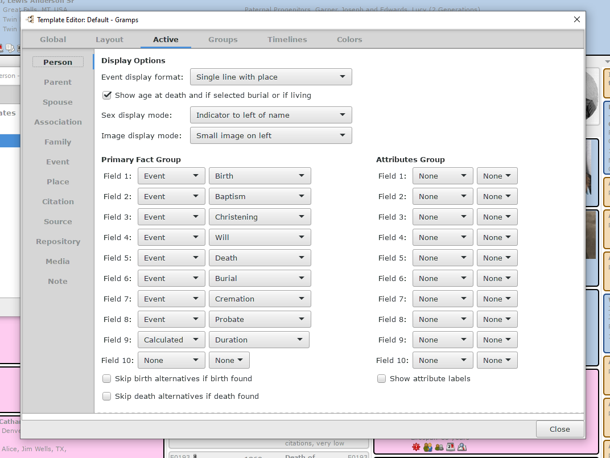

In the template configuration the primary and secondary fact groups support None, Event, Fact, Calculated, Attribute and Relationship field types. The attributes group controls fields added to the metadata section and it supports None, Attribute and Calculated types.

Attributes are self explanatory.  Events are as well, and the fact type basically exposes the description of an event as opposed to the date and location of an event. This useful for displaying things like occupation or education.

The relationship type allows you to select a person against whom the relationship calculator will be applied and any found relationship will be displayed. While the status bar provides this in relation to the home person when in a person view this option extends the concept to anyone in the tree.

The calculated field type exposes calculated data provided through the calculated field plugin interface and several plugins are provided.

* The duration calculator reports on the lifespan of a person, including if living, or for a married couple the duration of the marriage.

* The child number calculator reports on child number and optionally the age of each parent at time of birth and length of time parent married at time of birth.

* The progenitor calculator reports on the oldest paternal and maternal progenitors for a person.

* The marriage age calculator reports the age of each partner at the time of marriage.

* The relationship calculator here, as opposed to the built in one, reports on the closest possible relationship between the two partners in a marriage.

* Finally the occupations calculator examines and reports on all the occupations for a person.

Some field calculators have configuration options available for adjusting their behaviour or output.

### Child object indicators

These visually indicate certain child attributes exist for the object the card is for.

Currently provided indicators cover alternate names, parents, spouses, children, associations, events, ordinances, media, attributes, addresses, citations, notes and urls. All can be enabled or disabled in the configuration options and a user option enables the display of an object count next to each icon if desired.

Clicking on any of them will spawn a pinned group window with the cards for the objects that will behave pretty much the same as the pinned view windows discussed earlier.

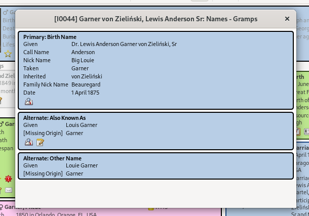

The URL group cards contain URL objects but an attempt is also made to parse them out of any notes associated with the object. The title link will launch the site in the default browser.

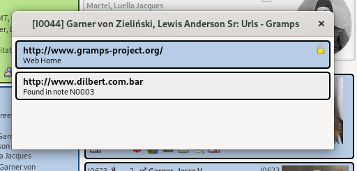

### Status indicators

These are meant to visually convey some information about the status of the object.

A status indicator plugin interface is available and a few plugins are provided.

* The confidence ranking indicator examines the confidences of the citations associated with numerous key events about a person and calculates a ranking that is exposed in the tooltip text. A solid gold star represents the top ranking for a fully documented individual.

* The citation alert indicator notifies the user certain key events are lacking citations. Clicking on it provides a context menu of the events and selecting one launches the event editor.

* The missing event indicator notifies the user certain key events are missing for the user and a list of them is exposed in the tooltip.

* The todo indicator indicates one or more todo notes exist.

Note most of these status indicators have numerous options for configuring what they will examine and present as well as what they will do when clicked on.

### Coloring schemes

For some card types support exists for coloring them based on specific attributes using a number of available color schemes all of which are configurable.

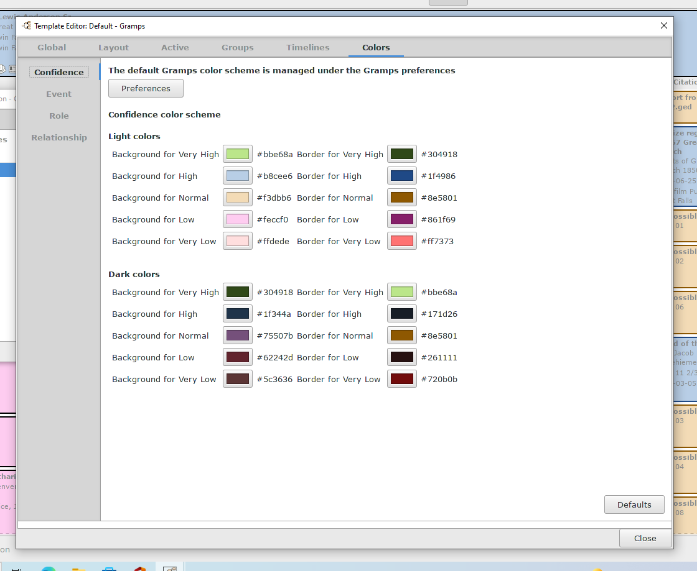

Reasonable default colors have been selected for each of the schemes.

Event cards in event groups can choose from using the default Gramps person scheme, the event role scheme, the event category scheme or the evidence confidence scheme. Timeline event cards can choose from the same set as event cards as well as the relationship scheme. Confidence cards always use the evidence confidence scheme.

### Timeline filters

The person, family and place timeline contents are all also highly customizable.

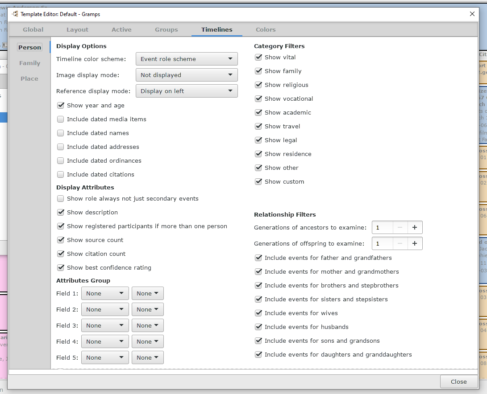

Event categories can be included or excluded for all timelines.

For person timelines events for selected relations can be included or excluded, including those going back more than a single generation. These relation events can also be filtered by category.

For a person timeline additional cards for dated objects that are not events can also be included. At the present time these include media items, names, addresses, ordinances, and citations. A subset of these are also available for family timelines.

A family timeline by design will include events for all members of family, from the births of the spouses to the death of the last child.

A place timeline will attempt to show all events at a given place.

Note that object groups, including timelines, do have some maximum size settings so not all objects may be shown. This is necessary to some extent as trying to display a thousand or more cards does not work well. Places are an example of where this can frequently happen.

### Media bar

A simple compact media bar is available as an alternative to including a bulkier media object group.

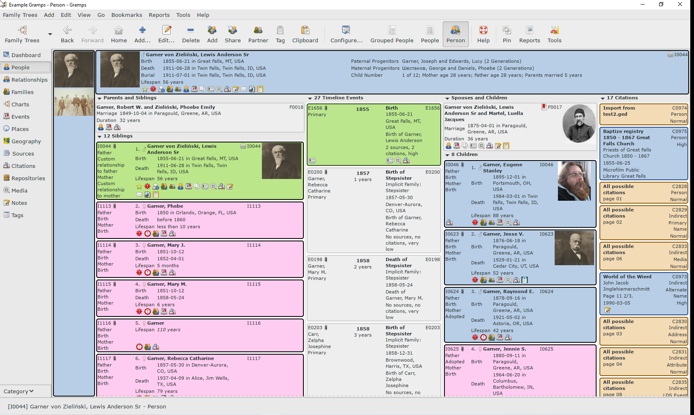

If your media objects have a Media-Type attribute options are available to group the media by type, to filter out non-photos, and to sort by date. The bar can be positioned on the left or right side or horizontally between the header the and object group section. The configuration context menu has a toggle for enabling or disabling the display of the bar.

### Zotero support

Basic support has been added for interfacing with local Zotero clients if they have the [Better BibTex](https://retorque.re/zotero-better-bibtex/installation/) extension installed. When enabled under the action context menu under citations will be an option to add a citation using Zotero. If the local Zotero client is offline or not responding this option will be disabled.

This is largely one way support, allowing you to use the citation picker in the client and pulling the source and citation information into Gramps.

For this to work reliably it is best if you use static citation keys, the key is stored in the Source record in the Zotero-key attribute. If it changes in Zotero then the next time you generate a Citation for Gramps it will not find the old Source record and will create a new one.

Other attributes about the Source in Zotero are also imported and stored in the Source attributes. There is experimental support to import notes as well, but they are imported in raw html format. Note if you change source data in Zotero then the next time you generate a Citation for that Source it will update the Source with the changes on the Gramps side.

Bug Reports and Feature Requests
---------------

> Please check the [known issues](KNOWN_ISSUES.md) before reporting a bug or problem with the addons here.

For the moment, after you have checked the known issues, then bugs can be submitted on [Github](https://github.com/cdhorn/CardView). Feature requests are welcome as well.

Once folded into the Gramps Addons repository and published such things will be handled through the normal Gramps support channels and this repository will be archived.

History
---------------

This started as a Gramplet to learn about Gtk and toy around a bit. The framework provided by Nick Hall's [Combined View add-on](https://www.gramps-project.org/wiki/index.php/Addon:CombinedView) serves as the View Mode underpinnings -- although it has been extended to apply to all object types. Several other large pieces of code are also derived from the work of other Gramps developers to whom I am indebted.

*Enjoy!*

- Chris
